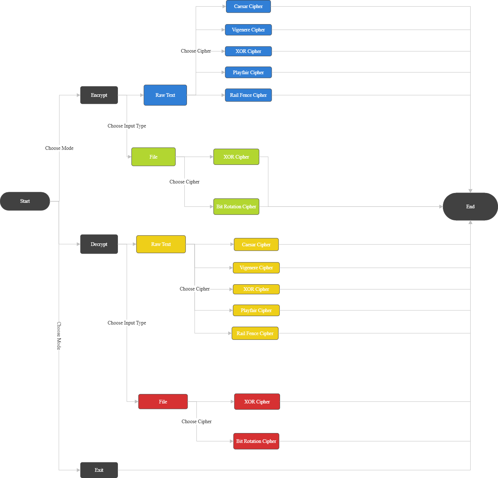

# CERBERUS
#### Video Demo:  [Project Cerberus](https://youtu.be/wSJQdN9AC2U?si=ezks44fOQL_HZVk7)
#### Description: Cerberus is a command-line encryption tool that allows users to encrypt and decrypt raw text using multiple well-known ciphers, including Caesar Cipher, XOR, Vigenère Cipher, Playfair, and Rail Fence Cipher. It also supports encryption and decryption of both text and binary files using various ciphers.

### Introduction
>The program follows a decision-based flow control system, where each user input determines the next set of options, guiding the user through a structured sequence until the final output is generated.
>I was determined in this project to build this project on my own, without relying on external libraries or CS50 helpers.

#### This project is modularized into five main files: ```main.c```, ```helpers.c```, ```encrypt.c```, ```decrypt.c```, and ```file_io.c```. Each file has its own specific role.
- ```main.c``` is responsible for controlling the program's flow and handling user interaction.

- ```helpers.c``` contains categorized utility functions used to support various parts of the program. Some functions are general-purpose (like input handlers), while others serve specific components, such as menu control and file handling.
- The encryption and decryption logic is divided into two main categories: raw text and file handling.
- For raw text, the logic is split between  ```encrypt.c``` and ```decrypt.c```.
- For file encryption and decryption (both text and binary files), all related logic is implemented in a single file, ```file_io.c```.

### ```main.c```
<p align="left"></p>

> Note: Colors indicate data type and operation; blue for raw text encryption, green for file encryption, orange for raw text decryption, and red for file decryption.

```main.c``` is the file where I coded the user interface and the decision-driven menu logic, I like to say it's the file that gathers all the puzzle pieces together.

The diagram above represents the decision-driven menu logic used in main.c. Each user input determines the next step; starting from choosing encryption or decryption, then selecting raw text or file operations, and finally picking the cipher to apply.

To make the user experience smoother, I added flexible input validation. The user can enter either the number of their choice or type the actual name of the option, and the program will handle both correctly.

### ```encrypt.c``` and ```decrypt.c```
These two files handles the raw text ciphers, ```encrypt.c``` is responsible for the encryption logic, while ```decrypt.c``` handles the decryption logic for each cipher.

In total there are 5 ciphers, each operating in a unique way:
- Caesar Cipher.
- Vigenère Cipher.
- XOR Cipher.
- Playfair Cipher.
- Rail Fence Cipher.

#### Caesar Cipher
The Caesar Cipher is one of the simplest and oldest methods of encrypting messages, named after Julius Caesar, who reportedly used it to protect his military communications.
It operates as follows:
- It takes an integer key, then shifts each the letter in the plaintext by that number of positions in the alphabet.
> For example, with a key of 3, 'A' becomes 'D', 'B' becomes 'E', and so on.
So, encrypting "Hello, world" with a key of 3 results in "Khoor, zruog".

#### Vigenère Cipher
The Vigenère Cipher is a method of encrypting alphabetic text using repeating keyword, applying a form of polyalphabetic substitution.

How it works:
- It takes an alphabetic key. If the key is shorter than the plaintext, it gets repeated until it matches the length.
- Each letter of the plaintext is converted to its ASCII value and added to the corresponding key character’s ASCII value.
- The result is then modulo 26 to ensure it wraps around the alphabet, and converted back to a character.
- This repeats for each letter in the text.

> For example, with the key "hglkss" and the text "Hello, This is CS50", the result would be "Okwvg, Lood sk UZ50".

#### XOR Cipher
XOR is a symmetric cipher, meaning the function used in the encryption process is the same as the one used in the decryption process.

XOR Encryption is an encryption method used to encrypt data and is hard to crack by brute-force method, i.e generating random encryption keys to match with the correct one.

How it works:
- It takes a key of type string -could be any character, numbers, punctuation,...etc-, if the key is shorter than the plaintext, it gets repeated until it matches the length.
- Each character is converted to its ASCII code, which is then treated as binary and compared with the corresponding key character's binary.
- Each bit of the plaintext's character is compared with its corresponding bit of the key's character, in which if they are the same the result is 0, and 1 if they are different creating a whole new character at the end of each character's comparison.

#### Playfair Cipher
The Playfair cipher was the first practical digraph substitution cipher. The scheme was invented in 1854 by Charles Wheatstone but was named after Lord Playfair who promoted the use of the cipher. In playfair cipher unlike traditional cipher we encrypt a pair of alphabets(digraphs) instead of a single alphabet.
It was used for tactical purposes by British forces in the Second Boer War and in World War I and for the same purpose by the Australians during World War II. This was because Playfair is reasonably fast to use and requires no special equipment.

How it works:
- It takes an alphabetical key. Using the key it generates a 5x5 matrix containing the alphabets. Each of the 25 alphabets must be unique and one letter of the alphabet (usually J) is omitted from the table (as the table can hold only 25 alphabets). If the plaintext contains J, then it is replaced by I.
The initial alphabets in the key square are the unique alphabets of the key in the order in which they appear followed by the remaining letters of the alphabet in order.
- Then the plaintext is split into pairs of letters (digraphs). If the plain text has an odd number of characters we add a filler character at the end of the plaintext (usually X). If there is a digraph that has the same letter twice, we add a filler character with the first letter and the second create a digraph with the next character.
- After generating the matrix and the digraphs, for each digraph, if both characters are in the same row, shift each one to the right (wrapping around). If they're in the same column, shift each one down. Otherwise, if they're in different rows and columns, replace each character with the one in its row and the other character’s column.

#### Rail Fence Cipher
The rail fence cipher (also called a zigzag cipher) is a form of transposition cipher. It derives its name from the way in which it is encoded. In a transposition cipher, the order of the alphabets is re-arranged to obtain the cipher text.

How it works:
- It takes an integer key, which will be the number of rows (rails) that will shape the imaginary fence.
- The plain-text is written downwards and diagonally on successive rails of an imaginary fence.
- When we reach the bottom rail, we traverse upwards moving diagonally, after reaching the top rail, the direction is changed again. Thus the alphabets of the message are written in a zig-zag manner.
- After each alphabet has been written, the individual rows are combined to obtain the cipher text.

### ```file_io.c```
This file handles file encryption and decryption. To keep things simple and reduce bugs, I chose to manage user input branching and variable declarations directly in main.c, even if that led to some repetition. I prioritized clarity and control over abstraction in this part of the program.

The file is divided into two main parts:
- Text Files: Supports .txt and .csv extensions only.
- Binary Files: Supports all other file types.

Each type supports two ciphers, and XOR Cipher is common between both.

#### Text Files
Supported Ciphers: Caesar Cipher and XOR Cipher

For both ciphers, I used the same logic as in the raw text encryption. The difference is that here, the logic is applied character by character using file streams.\
Each function takes two FILE* pointers—one for the input file and one for the output. The program reads one character at a time, applies the cipher, and writes the result to the output file.

#### Binary Files
Supported Ciphers: Bit Rotation Cipher and XOR Cipher\
The XOR cipher here is reused from the text file section—it works the same way because XOR logic is symmetric and applies cleanly to binary data.

##### Bit Rotation Cipher
This cipher is somewhat similar in spirit to the Caesar cipher—but instead of shifting letters in the alphabet, it shifts bits within each character's binary representation.

- The user provides a key from 1 to 7.
- That key determines how many bits to rotate to the left.
- For each character, its 8-bit binary representation is taken. We then:
- Slice off the first key bits from the left.
- Shift the remaining bits to the left.
- Wrap the sliced bits around and attach them to the end.

Think of it like taking the first few bits, temporarily putting them "in your hand," sliding the rest of the bits forward, and then dropping the ones you saved at the back. That gives you a new binary sequence—and thus a new encrypted character.

> For example, the ASCII character 'A' is 01000001.\
If the key is 3, the result would be:\
Before: 01000001\
After left-rotating 3 bits: 00001010

This new bit pattern is then converted back into a character, giving you the encrypted version. Decryption simply rotates the bits in the opposite direction using the same key.

### How to use?
1. Compile the program using the provided Makefile: ```make```.
2. Run the program: ```./cerberus```.
3. Follow the on-screen prompts to select encryption/decryption, input type, and cipher.

The program will display an error message if something goes wrong.

When decrypting raw text, make sure you're providing only the intended text—no spaces before or after. Extra spaces may lead to incorrect results.

For file input, the file must be in the same folder as the program. Otherwise, you'll see a "Couldn't open the file" error.\
Also, be sure to include the file extension (e.g., file.txt). If you just type file without the extension, the program will not accept it and will display the same error message.

### Academic Honesty
I used ChatGPT throughout the development of this project, but only as a tool to help me better understand the topics, explain certain concepts, assist with debugging, and identify possible issues in my code. All the core logic, code, and program design were implemented by me. Any help received was strictly to improve the robustness and clarity of the project.
